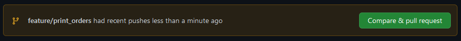

# Hello world

Hoi allemaal

# Bug

De applicatie berekent de bruto prijs (incl. BTW) van de orders in het gegeven json bestand. Er gaat alleen iets mis: de totaal prijs is veel te hoog in sommige gevallen!

# Tests

## Uitvoeren van tests

Je kunt de tests op verschillende manieren uitvoeren.

Met het volgende commando voer je alle tests van de hele applicatie uit:

```bash
go test ./...
```

Met het volgende commando voer je de tests van een specifieke package uit:

```bash
go test che/dt/week2/orders/business
```

In VS Code kun je specifieke tests uitvoeren door op de 'play' knop links van de test functie te klikken, of op 'run test' of 'debug test'

## Test cases

De applicatie bevat twee functies in de `business` package die je goed kunt testen:

- `CalculateTotal`
- `CalculateTotalOrderPrice`

Voor `CalculateTotalOrderPrice` kun je de volgende tests schrijven:

- `TestCalculateTotalOrderPrice_MultipleOrderLines_GivesExpectedTotal` - Test dat een order met meerdere orderregels van verschillend prijs, aantal en btw tarief het juiste totaalbedrag teruggeeft
- `TestCalculateTotalOrderPrice_NoOrderLines_GivesTotalZero` - Test dat een order zonder order regels een totaal van 0 teruggeeft
- `TestCalculateTotalOrderPrice_SingleOrderLine_GivesExpectedTotal` - Test dat een order met eén orderregel het juiste totaalbedrag teruggeeft
- `TestCalculateTotalOrderPrice_OrderLineWithDiscount_GivesExpectedTotal` - Test dat een order met een orderregel met een kortingspercentage het juiste totaalbedrag teruggeeft
- `TestCalculateTotalOrderPrice_OrderLineWith21PercentVat_GivesExpectedTotal` - Test dat een order met een orderregel met een btw tarief van 21% het juiste totaalbedrag teruggeeft
- `TestCalculateTotalOrderPrice_OrderLineWith9PercentVat_GivesExpectedTotal` - Test dat een order met een orderregel met een btw tarief van 9% het juiste totaalbedrag teruggeeft
- `TestCalculateTotalOrderPrice_NegativeQuantity_GivesError` - Test dat een order met een orderregel met een negatieve aantal een error teruggeeft
- `TestCalculateTotalOrderPrice_NegativePrijs_GivesError` - Test dat een order met een orderregel met een negatieve prijs een error teruggeeft

> Bedenk zelf test cases voor de `CalculateTotalOrderPrice` functie

# Fork (week 2)

Spreek met een persoon af om samen te werken aan deze opdracht. Neem de volgende stappen:

1. **Eén van jullie** klikt rechtsboven op `Fork`. Hiermee kopieert hij/zij de repository naar zijn/haar eigen omgeving. 
2. Vervolgens gaat die persoon naar `Settings` &gt; `Collaborators`. Bij `Manage access` voeg je de ander persoon toe, zodat jullie beiden kunnen werken aan deze repo. 
3. Ga **beiden** in jullie github repo naar `Code` (eerste tab) en klik op de groene knop `Code`, een dropdown verschijnt.
4. Controleer dat `HTTPS` is geselecteerd, en klik op het `kopieer` icoontje naast de url
5. Open een terminal in je Visual Code omgeving en zorg dat je in je DT directory zit
6. Type: `git clone <plak hier de gekopieerde url>`
7. Open deze nieuw aangemaakt folder (`ICT-DEV-DT-18-week2-orders`) in Visual Code

Vervolgens maakt 1 van jullie de improvement zoals beschreven in de improvement sectie hieronder. De ander hernoemt de variabele `sum` naar `totaal` in de functie `CalculateTotal(...)`. Degene die de improvement maakt hernoemt de variabele `sum` niet! Controleer dat jullie wijzingen hebben gemaakt op dezelfde regel.

Commit jullie werk en push het allebei naar jullie remote repo (github).

# Improvement

Er zit een veld voor korting op de order: pas de korting toe op de totaal prijs van elk order. Als de korting 7% is, dan heeft het veld `korting` de waarde `.07`.

$$totaal = (1 - korting) \sum_{r \in Regels} r_{aantal} \times r_{prijs} \times r_{btw}$$

> Bovenstaande formule wordt wel goed weergegeven in Visual Code preview, maar niet op github.

Schrijf ook een test om deze improvement te bewaken.

# Fork (week 3)

## Voorbereiding (stap 1/7)
Spreek met een persoon af om samen te werken aan deze opdracht. Als je vorige week al een fork hebt gemaakt, of al samen hebt gewerkt met dezelfde buddy, sla dan waar nodig stappen over:

1. **Eén van jullie** klikt rechtsboven op `Fork`. Hiermee kopieert hij/zij de repository naar zijn/haar eigen omgeving. 
2. Vervolgens gaat die persoon naar `Settings` &gt; `Collaborators`. Bij `Manage access` voeg je de ander persoon toe, zodat jullie beiden kunnen werken aan deze repo. 
3. Ga **beiden** in jullie github repo naar `Code` (eerste tab) en klik op de groene knop `Code`, een dropdown verschijnt.
4. Controleer dat `HTTPS` is geselecteerd, en klik op het `kopieer` icoontje naast de url
5. Open een terminal in je Visual Code omgeving en zorg dat je in je DT directory zit
6. Type: `git clone <plak hier de gekopieerde url>`
7. Open deze nieuw aangemaakt folder (`ICT-DEV-DT-18-week2-orders`) in Visual Code

## Tag maken (stap 2/7)

De huidige versie van master beschouwen we als versie 0.1. Dit willen we vastleggen zodat we weten als er een bugmelding komt over v0.1, we weten over welke code het eigenlijk gaat. 

Een van jullie voert de volgende commando's uit, terwijl de ander meekijkt.

1. open een terminal in je working directory
2. Voer uit: `git tag -a v0.1 -m "Onze eerste prototype van de applicatie"`

> 💡 Met `git tag` creëer je een tag, `-a` staat voor 'annotated', daarom moet je ook een message (`-m`) opgeven. In de praktijk zul je vaak dezelfde tekst kiezen als de versie zelf. Er bestaan ook lightweight tags, maar het voordeel van annotated tags is dat er ook datum en auteur informatie zit, waardoor je meteen informatie hebt over wanneer de tag is gemaakt, en door wie. Daarom gebruiken we altijd annotated tags.

3. Voer uit: `git push --tags`, dit pushed de tags naar je origin (github)
4. De ander doet nu een git pull en heeft nu ook de tags in zijn lokale repo.
5. Dubbelcheck allebei in je git graph extensie of de tag zichtbaar is

> 🤓 Voor de enthousiastelingen die het leuk vinden om git via de commandline te gebruiken: je kan ook een grafische weergave om de commandline tonen: `git log --graph --all --oneline --decorate`.

> 🤓🤓 Voor de echte enthousiastelingen: je kunt de vorige commando opslaan via een alias, waardoor je voortaan alleen nog maar `git graph` hoeft te typen om bovenstaand commando uit te voeren: `git config --global alias.graph "log --graph --decorate --oneline --all"`

## Branch maken (stap 3/7)

Jullie gaan nu beiden een nieuwe feature maken, maar netjes volgens de Feature Branch Workflow. Verdeel de features die hieronder staat beschreven (maar begin er nog niet aan). Afhankelijk van welke feature je gaat maken, maak je een branch aan: 

 - `git checkout -b "feature/print_orders"` of 
 - `git checkout -b "feature/get_most_expensive_order"`

> 💡 Met `git checkout` kan je switchen tussen branches. Probeer maar eens `git checkout master` in te typen. Je zit nu weer op de master branch. Ga nu weer terug naar je eigen feature branch met `git checkout <je branch naam>` (let op: je branch naam begint dus met `feature/`). De optie `-b` geeft aan dat het om een nieuwe branch gaat. Git maakt dan eerst de branch aan voordat ie switcht van branch.
### `PrintOrders(orders []types.Order)`
 Print voor alle orders de naam van de organisatie, de omschrijving van de order, het aantal regels in de order en de totaalprijs van de order. Voorbeeld voor `orders-klein.json` als er nog een tweede order in stond:
```
 - Centuria: 2 regels, € 809.7266
 - Zounds: 5 regels, € 2738.21
```

Pseudocode:
```
foreach order in orders
  print(" - order.Organisatie: len(order.Regels), € CalculateTotalOrderPrice(order)")
```
### `GetMostExpensiveOrder(orders []types.Order) types.Order`
Retourneert de duurste order in de lijst van orders. 

Pseudocode:
```
max = 0
maxOrder = nil
foreach order in orders
  orderPrice = CalculateTotalOrderPrice(order)
  if orderPrice > max
    max = orderPrice
    maxOrder = order

return maxOrder
```

## Feature maken (stap 4/7)

Implementeer nu beide jullie eigen feature. Commit jullie werk en push je werk naar de origin (in ons geval github).

## Pull requests (stap 5/7)

Nu ga je naar github toe. Daar verschijnt op de `<> Code` pagina de volgende tekst:



Deze is handig om snel een pull request te maken. We gaan het nu op reguliere manier doen, zodat je ook weet hoe dat moet. 

1. Ga naar "Pull requests"
2. Klik op de knop `New pull request`
3. Omdat dit een Fork is van de originele repository, vult github die alvast in. Maar we willen niet mergen naar de originele repository, maar naar onze eigen master branch in onze eigen repository.
4. Dus: verander de eerste dropdown naar je eigen repository
5. Er verschijnt nu `base: master` in de dropdown
6. Kies in de tweede dropdown je feature branch
7. Er verschijnt `compare: feature/print_orders` (of de andere branch als je de andere feature doet natuurlijk)
8. Je ziet een overzicht van je pull request. Dubbelcheck dat het klopt en je niets raars ziet.
9. Klik op `Create pull request`
10. Je komt nu het scherm waar je je pull request kan afmaken. Kies rechts als 'reviewer' je buddy. 
11. Indien nodig kan je de titel of het commentaar aanpassen om de reviewer (je buddy) extra info te geven. Als titel pakt ie automatisch je laatste commit message (denk ik).
11. Klik op `Create pull request`
12. Je pull request is aangemaakt 🥳

## Pull request review & merge (stap 6/7)

Je gaat nu het pull request van je buddy reviewen en mergen. 

1. Ga naar github > `Pull requests`
2. Klik eventueel op Filters en kies voor `Everything assigned to you` om alleen de pull requests te zien die aan jou toegekend zijn
3. Open de pull request van je buddy en lees de pagina door en bekijk de verschillende tabs (`Commits`, `Checks` en `Files changed`)
4. Neem de code door in de tab `Files changed` en kijk of je het ermee eens bent. Voeg op z'n minst een commentaar toe door op het plusje te drukken bij een van de gewijzigde regels. Start daarmee een review.
5. Klik op `Finish your review` en laat een algemene tekst achter ter info voor je buddy
6. Kies voor `Approve` als je het er mee eens bent en de feature gemerged mag worden naar de master branch. Kies anders voor `Request changes`. In dit geval kiezen we voor `Approve`. Submit je review.
7. Je hebt de feature geaccepteerd en de wijzigingen gemerged in de master branch
8. Doe een pull, en bekijk de git graph om je wijzigingen te zien.

## Nieuwe versie! (stap 7/7)

Als beide features gemerged zijn naar de master branch, is het tijd om een nieuwe versie te maken. Maak een tag `v1.0` aan op de laatste commit van de master branch, en push deze naar de remote repo (github). De ander pulled de wijzigingen en controleert of de tag inderdaad is aangemaakt.

Jullie zijn klaar! 🥳

# Json

Json is gegenereerd middels [json-generator.com](https://json-generator.com/) met de volgende definitie:

```js
[
  '{{repeat(50)}}',
  {
    id: '{{index()}}',
    organisatie: '{{company()}}',
    regels: [
      '{{repeat(10, 20)}}',
      {
        nummer: '{{index()}}',
        btw: '{{random(21, 9, 0)}}%',
        aantal: '{{integer(1, 10)}}',
        prijs: '{{floating(10, 500, 2)}}',
        omschrijving: '{{lorem(3, "word")}}'
      }
    ],
    korting: '{{floating(0, .2, 2)}}',
    definitief: '{{bool()}}',
    datum: '{{date(new Date(2021, 0, 1), new Date(), "YYYY-MM-ddThh:mm:ssZ")}}'
  }
]
```
